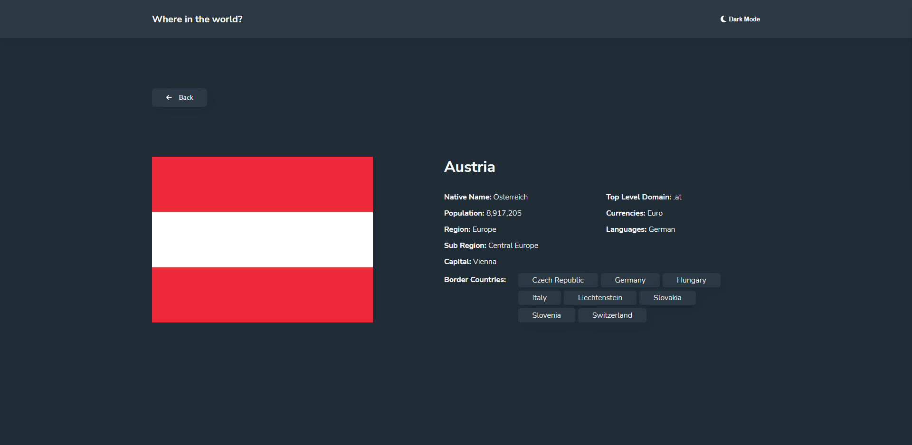
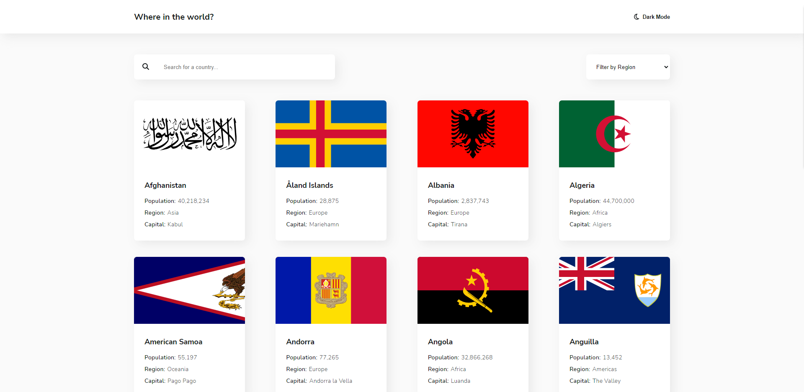

# Frontend Mentor - REST Countries API with color theme switcher solution

This is a solution to the [REST Countries API with color theme switcher challenge on Frontend Mentor](https://www.frontendmentor.io/challenges/rest-countries-api-with-color-theme-switcher-5cacc469fec04111f7b848ca). Frontend Mentor challenges help you improve your coding skills by building realistic projects.

## Table of contents

- [Overview](#overview)
  - [The challenge](#the-challenge)
  - [Screenshot](#screenshot)
  - [Links](#links)
- [My process](#my-process)
  - [Built with](#built-with)
- [Author](#author)

## Overview

### The challenge

Users should be able to:

- See all countries from the API on the homepage
- Search for a country using an `input` field
- Filter countries by region
- Click on a country to see more detailed information on a separate page
- Click through to the border countries on the detail page
- Toggle the color scheme between light and dark mode _(optional)_

### Screenshot

### Links

- Solution URL: [Solution](https://github.com/dawidwojtaszek/REST-Countries-API-Frontendmentor-Chalage)
- Live Site URL: [Live Site](https://countriesapi-frontendmentor.netlify.app/)

## My process

### Built with

- create-react-app
- [React](https://reactjs.org/)
- [Styled Components](https://styled-components.com/)
- [React Router DOM](https://reactrouter.com/en/main)
- [React Helmet](https://www.npmjs.com/package/react-helmet)

## Author

- Website - [Portfolio](https://www.dawidwojtaszek.pl)
- Frontend Mentor - [@dawidwojtaszek](https://www.frontendmentor.io/profile/dawidwojtaszek)
